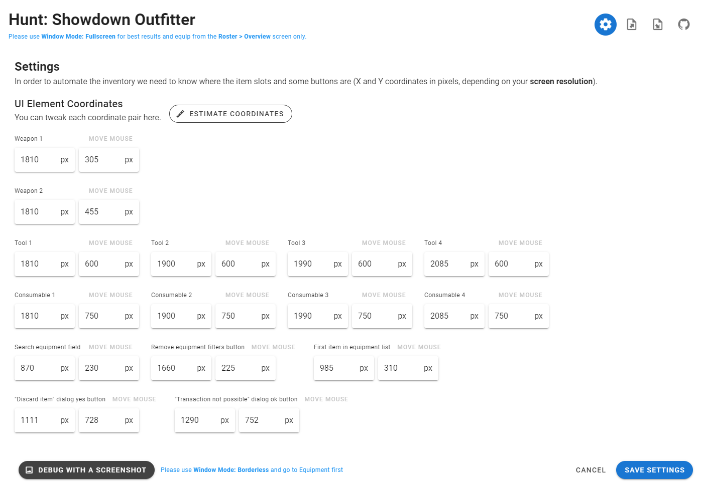

# Hunt: Showdown Outfitter

A tool to manage item presets for **Hunt: Showdown** and semi-automatically
equip them in the game by automating mouse and keyboard against
preconfigured UI coordinates.

The tool is pretty dumb and only works in the Roster > Overview screen,
you can only use it to equip items, no other automation during the game
is done.

### Use at your own Risk

- This software is a personal project and in no way affiliated with Crytek or the game itself.
- I am just so annoyed by equipping my hunters with the same loadouts all over again that I created this.
- **Attention**: The automation of keyboard/mouse input when using this tool can get you banned by the anti-cheat system. You have been warned.

### UI Screenshot


---



### Important Things to know

- Configure your `Settings > UI Coordinates` in the tool first before creating loadouts.
  - Start by pressing the **Estimate Coordinates** button and typing in your screen resolution (should be the default already), then tweak from there if needed.
  - A great tool to figure out coordinates visually is using [Greenshot](https://getgreenshot.org/) and its "Capture region" function which will display x/y pixel coordinates as you go.
  - The debug-screenshot buttons seems to give best result using the `Window Mode: Borderless`.
  - Each x/y coordinates should point roughly somewhere inside each UI element. Some randomness is applied later, so leave some pixels as wiggle room please. Ideally in a way that it doesn't matter if a weapon slot is e.g. large/medium/small (just target the left side). The debug-screenshot results should look something like this:
    
- The equip-loadout buttons only work when Hunt: Showdown is running in `Window Mode: Fullscreen` and when you are on the `Roster > Overview` screen.
- You need to have Chrome or Edge installed on your Windows machine.
- Empty item slots will be deselected in Hunt when equipping.
- You can exclude item slots on a loadout using the checkbox, those will be skipped when equipping. That way you can e.g. just define tools and consumables as a base-loadout.
- Shift-Clicking the item checkbox will equip just this item slot in Hunt. Useful for debugging loadouts.
- After uneqipping an item, before equipping the desired item, the `Enter` key is pressed to get rid of a potential `Discard Item` dialog.
- The last imported/exported file that is opened on launch is remembered in this file: `C:\Users\your-username\hunt_showdown_outfitter.json`

### Known Issues

- When the tool is opened it will auto-load the latest saved/opened file.  File handling is still pretty clunky: Settings and loadouts must each be saved individually, but the changes are only written to disk when you press the Save button in the top toolbar.
- The tool has no idea about Hunt's items or current state, it just moves the mouse and clicks, so some specific situations may not be properly
- Trying to select the "Knife" will equip the Heavy Knife, as it always matches as first in  the list. Try a Knife legendary skin instead.
- Special ammo is not yet supported.

### Development

#### Prerequisites

Download and install Python 3.6+

```bash
$ pip install -r requirements.txt
```

#### Run local instance
```bash
$ python main.py
```

#### Build single file .exe

```bash
$ pip install pyinstaller
$ python -m eel --onefile --noconsole main.py frontend
```
