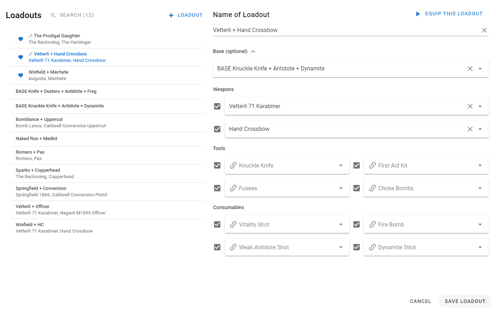

# Hunt: Showdown Outfitter

A tool to manage loadout presets for **Hunt: Showdown** and semi-automatically
equip them in the game by automating mouse/keyboard input against
preconfigured UI coordinates.

I consider this a fun experiment, but hope that it will become obsolete when actual loadout presets will be included in the game itself.

This software is a personal project and in no way affiliated with Crytek or the game itself.

## Won't this get me banned from Hunt?

I have reached out to the official Crytek support at www.huntshowdown.com and asked about this specific software and input macros in general and have received the following response (October 2021):

  

Phew, that's a relief! I can give no guarantees though (maybe they change their stance on this in the future), so **use at your own risk**.


## Video of Outfitting in Game

[](https://streamable.com/s9qo17)

## Screenshots of the Interface


---



## Features

- Define loadouts to equip
  - Partial loadouts via item checkboxes
  - Duplicate loadouts to create variations
  - Use base loadouts to make it easier to change your usual setup later
- Equip loadouts in the running Hunt: Showdown instance (works only when on the Roster > Equipment page)
- Filter loadouts by name or items
- Favorite loadouts, which puts them to the top of the list
- Auto-estimate, tweak and debug UI coordinates for your screen resolution

## How to use

- Read the disclaimer above!
- All equipping only works when on the `Roster > Equipment` page in game!

### Installation
- Download the latest `hunt_showdown_outfitter.exe` [from the Releases page](https://github.com/cb109/hunt_showdown_outfitter/releases) (you can find the files under the release **Assets**)

### Initial Setup
- Launch `Hunt: Showdown` and set it to use `Window Mode: Borderless` temporarily (otherwise the screenshot debugging below won't work).
- Start the tool: It should show the settings screen with your UI coordinates estimated automatically.
  - In `Hunt: Showdown`, go to the `Roster > Equipment` screen.
  - In the tool, press the `Debug with a Screenshot` button and see if the result looks good.
  - Tweak UI the coordinates manually (overall via `Estimate Coordinates` or individually via the input fields) as needed and don't forget to press `Save Settings` when done.
    - You can press the "Move mouse" buttons to debug where those coordinates point to on your screen.
- Once happy with the UI coordinates, please save your file using the `Save As` button in the upper right corner of the screen.
- Now you can start creating/editing loadouts.
  - Don't forget to save each loadout.
  - Don't forget to use the `Save`/`Save As` buttons to save the file overall once you are done editing.

### Equipping a Loadout

- Make sure `Hunt: Showdown` is running and is set to use `Window Mode: Fullscreen` (otherwise automation may fail). You mave have to restart the game if you had used a different Window Mode before.
- Make sure that within `Hunt: Showdown` you are on the `Roster > Equipment` screen.
- In the tool, equip a loadout via one of the buttons or by doubleclicking it in the list.
  - You can also equip single items of a loadout py `shift`-leftclicking its checkbox. This is mainly useful to debug the text you've written in the item field.
  - You can select all/deselect all checkboxes by `alt`-leftclicking one of them.
  - If you want to stop the equipment procedure (or started it while on the wrong screen in game) simply hold the `Esc` key.
  - An empty slot in the tool means the slot will be emptied in the game.
    - If the item checkbox is disabled the slot will be skipped (e.g. for loadouts that only define tools and consumables).

## Commandline Interface

You can run the tool headless in a shell (e.g. cmd.exe) pass a file and loadout to equip. Helps to bind certain loadouts to a hotkey, for example.

```
Usage: hunt_showdown_outfitter.exe [OPTIONS]

Options:
  -f, --input-file TEXT  File containing loadouts and settings (.json)
  -l, --loadout TEXT     Loadout to equip (matched by ID or name)
  --help                 Show this message and exit.
```

Example:

```
> hunt_showdown_outfitter.exe -f my_loadouts.json -l "Vetterli + Hand Crossbow"
```

## Helpful Things to know

- A great tool to figure out coordinates visually is using [Greenshot](https://getgreenshot.org/) and its "Capture region" function which will display x/y pixel coordinates as you go.
- The `Debug with a Screenshot` button seems to give best result using the `Window Mode: Borderless`.
- Each x/y coordinates should point roughly somewhere inside each UI element. Ideally in a way that it doesn't matter if a weapon slot is e.g. large/medium/small (just target the left side). The debug-screenshot results should look something like this:
  
- Items are equipped using doubleclick, which just assigns them from the inventory if available or buys them if needed. Unfortunately there is no way to prefer/select contraband items right now.
- It doesn't matter if your current Hunter already has items equipped, those will be unequipped if possible, but discarded if needed. So maybe unequip your extra Nitro manually if you don't want to lose it.
- The last imported/exported file that is opened on launch is remembered in this file: `C:\Users\your-username\hunt_showdown_outfitter.json`. Clicking the `Reset current filepath` marker will delete this file, so you can start fresh if needed.
- You need to have Chrome or Edge installed on your Windows machine for the frontend to work.

## Known Issues

- When the tool is opened it will auto-load the latest saved/opened file.  File handling is still pretty clunky: Settings and loadouts must each be saved individually, but the changes are only written to disk when you press the Save button in the top toolbar.
- The tool has absolutely no idea of the current game state, it just moves the mouse and clicks and types the text you specified. As a result, some situations can not be easily handled, e.g. trying to select the "Knife" will equip the Heavy Knife, as it always matches as first in  the list. Use a legendary skin with a more unique name instead.
- Special ammo, dual wielding and stacked consumables are not yet supported.
- Autocomplete is currently hardcoded for the english item names only.
- Estimation may not work for your specific scenario: For now it is limited to using the native resolution of your screen. So far I have confirmed this works for 2560x1080 and 2560x1440. Let me know if you run into problems for other resolutions.

## Development

### Prerequisites

Download and install Python 3.7+

```bash
pip install -r requirements.txt
```

### Run local instance
```bash
python main.py
```

### Compile list of high level dependencies
```bash
pip install pip-tools
pip-compile
```

### Build single file .exe

```bash
python -m eel --onefile --noconsole main.py frontend --icon build.ico
```
